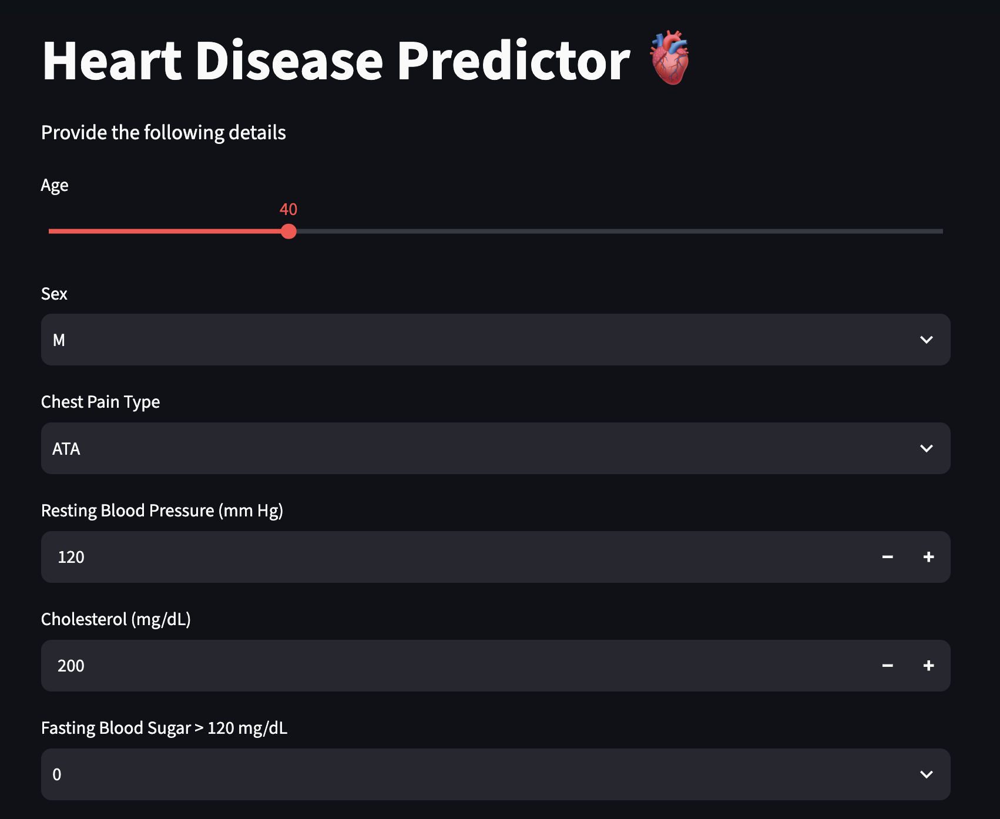
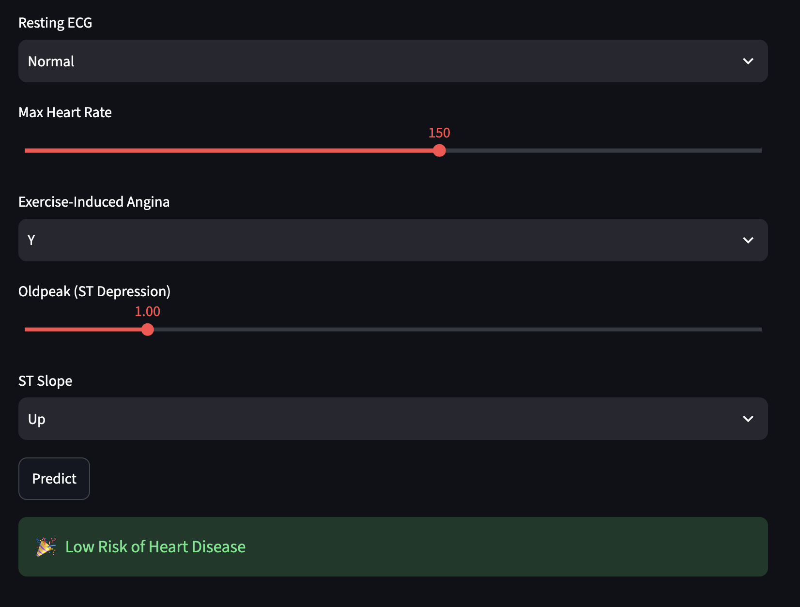

# Heart Disease Prediction

A machine-learning web application that estimates the likelihood of heart disease from clinical measurements and patient-reported attributes. The project includes an exploratory analysis and training notebook, a trained Support Vector Classifier (SVC), and an interactive Streamlit interface for making predictions.

> **Medical disclaimer:** This project is for educational and demonstration purposes only. It is not a diagnostic tool and must not be used as a substitute for advice, diagnosis, or treatment from a qualified healthcare professional.

**Project repository:** [github.com/suprim-karki/ai-ml-portfolio](https://github.com/suprim-karki/ai-ml-portfolio/tree/main/machine-learning/projects/heart-disease-prediction)

## Application preview

| Patient input form | Prediction result |
| --- | --- |
|  |  |

## Features

- Interactive Streamlit form for entering patient attributes
- Data cleaning, exploratory data analysis (EDA), encoding, and feature scaling
- Comparison of Logistic Regression, K-Nearest Neighbors, Gaussian Naive Bayes, Decision Tree, and SVC models
- Persisted SVC model, `StandardScaler`, and expected feature schema for reproducible inference
- Clear high-risk and low-risk prediction messages

## Project structure

```text
heart-disease-prediction/
├── app.py                         # Streamlit prediction application
├── heart_disease.ipynb            # EDA, preprocessing, training, and model export
├── heart.csv                      # Source dataset
├── svc_heartdisease.pkl           # Trained Support Vector Classifier
├── scaler_heartdisease.pkl        # Fitted StandardScaler for numeric features
├── columns_heartdisease.pkl       # Training feature-column order
└── README.md
```

## Dataset and features

The dataset was obtained from Kaggle and contains patient records with a binary `HeartDisease` target (`0` for no heart disease and `1` for heart disease). The application collects the following features:

| Feature | Description |
| --- | --- |
| `Age` | Age in years |
| `Sex` | Biological sex recorded in the dataset (`M` or `F`) |
| `ChestPainType` | Chest-pain category (`ATA`, `NAP`, `TA`, or `ASY`) |
| `RestingBP` | Resting blood pressure in mm Hg |
| `Cholesterol` | Serum cholesterol in mg/dL |
| `FastingBS` | Fasting blood sugar above 120 mg/dL (`0` or `1`) |
| `RestingECG` | Resting electrocardiogram result (`Normal`, `ST`, or `LVH`) |
| `MaxHR` | Maximum heart rate achieved |
| `ExerciseAngina` | Exercise-induced angina (`Y` or `N`) |
| `Oldpeak` | ST depression induced by exercise relative to rest |
| `ST_Slope` | Slope of the peak exercise ST segment (`Up`, `Flat`, or `Down`) |

During preprocessing, zero values in `RestingBP` and `Cholesterol` are treated as invalid and replaced with the mean of the corresponding non-zero values. Categorical variables are one-hot encoded and numeric features are standardized.

## Getting started

### Prerequisites

- Python 3.9 or later
- `pip`

### Installation

From this project directory, create and activate a virtual environment:

```bash
python3 -m venv .venv
source .venv/bin/activate
```

Install the required packages:

```bash
pip install streamlit pandas scikit-learn joblib jupyter seaborn matplotlib
```

### Run the application

```bash
streamlit run app.py
```

Streamlit will print a local URL, usually `http://localhost:8501`. Open it in a browser, enter the requested patient information, and select **Predict**.
